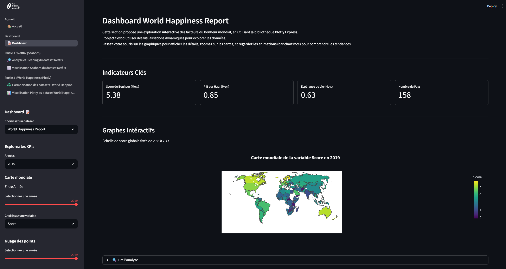

# Analyse de Données et Dashboard Streamlit : Netflix & World Happiness

[](https://www.python.org/)
[](https://streamlit.io)
[](https://pandas.pydata.org/)
[](https://plotly.com/)
[](https://seaborn.pydata.org/)

**[ 🔴 (Bientôt) Voir l'application déployée ici ]**

Ce projet est une application web de data visualisation complète, construite avec **Streamlit**, qui répond à un cahier des charges académique précis. Il démontre une maîtrise de l'ensemble du pipeline de data analyse : du nettoyage (Data Cleaning) et de l'analyse exploratoire (EDA) à la création de visualisations statiques (`Seaborn`) et de dashboards interactifs (`Plotly`).

L'une des particularités de ce projet est l'utilisation de **Streamlit** et de sa nouvelle fonctionnalité `st.navigation` pour transformer une analyse de données traditionnelle (de type Jupyter Notebook) en une application web multi-pages dynamique et professionnelle.

---

## 🚀 Aperçu du Dashboard Interactif

La pièce maîtresse de ce projet est le dashboard interactif, qui combine les deux analyses en un seul outil puissant avec une sidebar dynamique, des KPIs et des graphiques interactifs.

*(**Note :** Remplacez cette image par un GIF que vous aurez capturé de votre page "Dashboard" en action. C'est essentiel.)*



---

## 🎯 Objectifs du Projet (selon le Cahier des Charges)

Ce projet est divisé en deux parties principales, chacune avec une bibliothèque de visualisation distincte :

1.  **Partie 1 : Analyse Statique avec `Seaborn`**
    * **Dataset :** Netflix Movies and TV Shows
    * **Objectif :** Utiliser les graphiques statistiques de Seaborn (`countplot`, `barplot`, `histplot`, `heatmap`, `boxplot`) pour identifier les tendances de contenu, la stratégie géographique et les modèles temporels du catalogue Netflix.

2.  **Partie 2 : Analyse Interactive avec `Plotly`**
    * **Dataset :** World Happiness Report (5 fichiers CSV de 2015 à 2019)
    * **Objectif :** Démontrer des compétences en ingénierie de données (harmonisation de 5 fichiers), puis utiliser la puissance de Plotly (`choropleth`, `scatter`, `line`, `bar chart race`) pour explorer de manière interactive les facteurs qui influencent le bonheur mondial.

---

## 🛠️ Stack Technique

* **Langage :** Python
* **Analyse & Manipulation de Données :** Pandas, NumPy
* **Visualisation de Données (Statique) :** Matplotlib & Seaborn
* **Visualisation de Données (Interactive) :** Plotly Express
* **Application Web & Dashboarding :** Streamlit

---

## 🧭 Structure du Projet : Du Processus au Produit Fini

L'architecture de l'application est conçue pour mettre en valeur à la fois le **processus d'analyse** (tel que demandé par le cahier des charges) et le **produit final** (le dashboard interactif).

### 1. Le Processus (Le "Making-of" Académique)

Les sections "Partie 1" et "Partie 2" de la barre de navigation sont conçues pour montrer le travail d'analyse étape par étape :

* **Page "Analyse et Cleaning (Netflix)" :** Démontre le processus de Data Cleaning sur le dataset Netflix, en utilisant `st.echo()` pour expliquer les transformations de données.
* **Page "Visualisation (Seaborn)" :** Présente les graphiques statiques de Seaborn avec une analyse textuelle détaillée sous chaque graphique, conformément à la demande.
* **Page "Harmonisation (Happiness)" :** Explique le processus d'ETL complexe nécessaire pour fusionner et nettoyer les 5 fichiers CSV du World Happiness Report.
* **Page "Visualisation (Plotly)" :** Présente les graphiques interactifs de Plotly avec les conclusions analytiques associées.

### 2. Le Produit Fini (Le Dashboard Interactif)

La page **"Dashboard"** est la synthèse de ce projet. C'est un outil d'exploration qui :
* Utilise un **routeur** pour charger les modules de dashboard (`netflix_page.py`, `happiness_page.py`).
* Dispose d'une **sidebar dynamique** qui affiche des filtres contextuels en fonction du dataset sélectionné.
* Affiche des **KPIs** (`st.metric`) qui se mettent à jour en temps réel.
* Intègre des visualisations avancées comme un **"Bar Chart Race"** animé.
* Utilise le caching (`@st.cache_data`) pour des performances optimales.

---

## 🔧 Lancer le Projet Localement

Pour explorer l'application sur votre machine :

1.  **Clonez le dépôt :**
    ```bash
    git clone [https://github.com/RashOps/projet-data-visualisation.git](https://github.com/RashOps/projet-data-visualisation.git)
    cd VOTRE_PROJET
    ```

2.  **Créez un environnement virtuel (recommandé) :**
    ```bash
    python -m venv venv
    source venv/bin/activate  # Sur Mac/Linux
    .\venv\Scripts\activate   # Sur Windows
    ```

3.  **Installez les dépendances :**
    ```bash
    pip install -r requirements.txt
    ```

4.  **Lancez l'application Streamlit :**
    *(Assurez-vous de lancer `app.py`, qui est le nouveau contrôleur de navigation)*
    ```bash
    streamlit run app.py
    ```